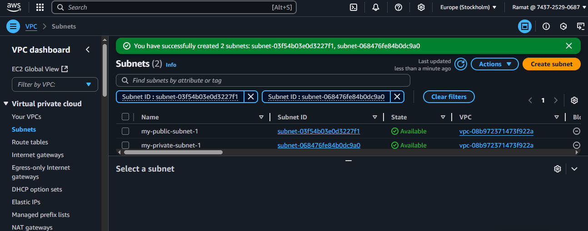
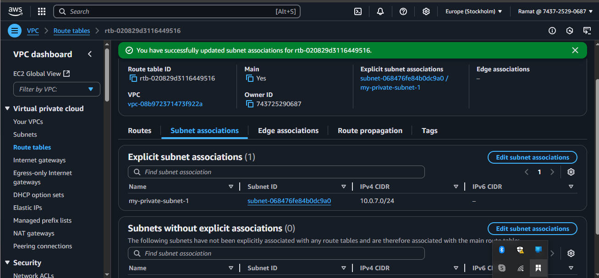

# private-cloud
## Virtual private cloud is the imginary storage in the cloud where all kind of data are stored.
## During the storage process there some term and process are involved.
## Those are 
- IP
- CIDR
- GATEWAY
- ROUTE TABLE

### IP :IP address is a unique set of number that are assign to helps computer find and communicate with each others suc as the internet.

### CIDR: Classless inter-Domain routing it make it easier to talk about group of ip addresses on the internet.

### Gateway : they act as a doorway between different networks. it helps data travel between your local network and other network.

### Route table : A route table is like a map that helps data find it ways around a network. it also known as NAVIGATION SYSTEM for data on a network, helping it find the fastest and most efficient paths to where its needs to go.

